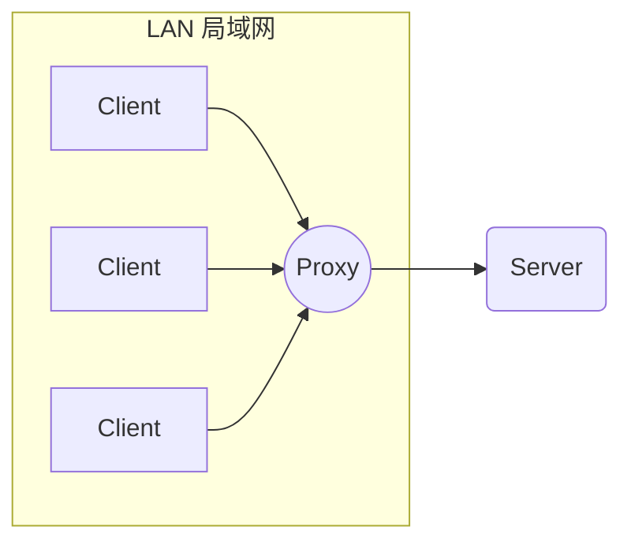
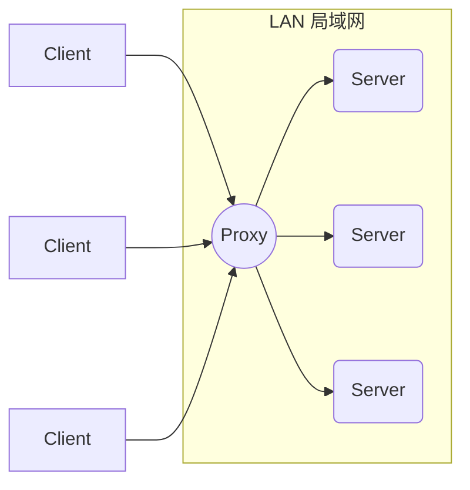
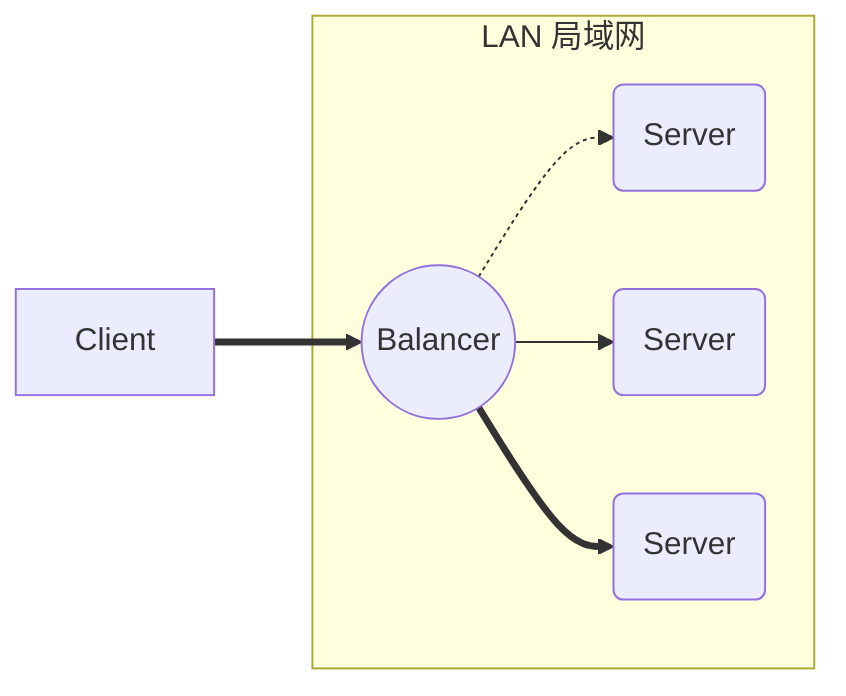
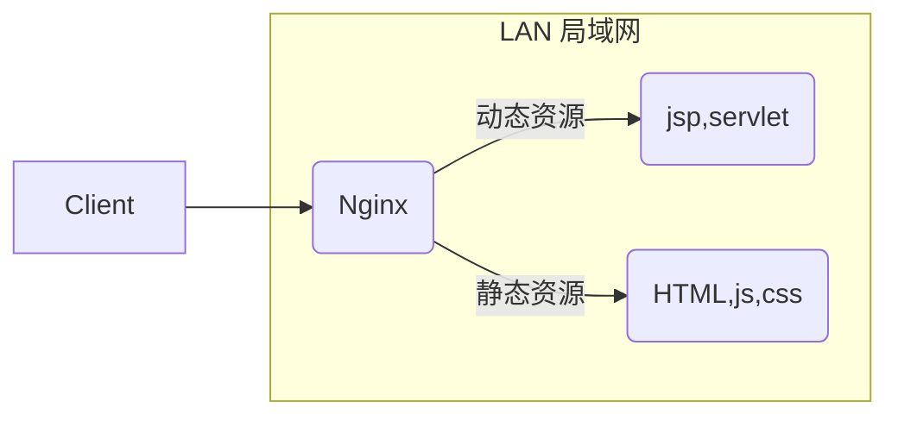

:::tips
Nginx 是开源、高性能、高可靠的 Web 和反向代理服务器，而且支持热部署，几乎可以做到 7 * 24 小时不间断运行，即使运行几个月也不需要重新启动，还能在不间断服务的情况下对软件版本进行热更新。
:::


<!-- more -->


Nginx 的最重要的几个使用场景：

- 静态资源服务，通过本地文件系统提供服务；

- 反向代理服务，延伸出包括缓存、负载均衡等；

- API 服务，OpenResty ；

  

下面着重先学习下 Nginx 的几个概念。

## 正向代理和反向代理

反向代理（Reverse Proxy）对应的是正向代理（Forward Proxy）

### 正向代理

:::info{title="相关知识"}

正向代理隐藏了真实的客户端

:::

客户端先向代理服务器发送请求，并指定目标服务器（源服务器），然后由代理服务器和原始服务器通信，转交请求并获得的内容，再返回给客户端。**正向代理隐藏了真实的客户端**，为客户端收发请求，使真实客户端对服务器透明。



### 反向代理

  

:::info{title="相关知识"}

反向代理隐藏了真实的服务器

:::

客户端先向代理服务器发送请求，代理服务器将请求转发给内部网络上真正进行处理的服务器，得到的结果返回给客户端。**反向代理隐藏了真实的服务器**，为服务器收发请求，使真实服务器对客户端透明。一般在处理跨域请求的时候比较常用。现在基本上所有的大型网站都设置了反向代理。



### 负载均衡

  

:::info{title="相关知识"}

Nginx 实现负载均衡，一般来说指的是将请求转发给服务器集群。

:::

#### 多服务器均衡

对于早期的系统来说，网络请求功能要求不复杂，且并发请求相对较少的情况下还能胜任，成本也低。随着信息数量不断增长，访问量和数据量飞速增长，以及系统业务复杂度持续增加，这种做法已无法满足要求，并发量特别大时，服务器容易崩。

  

很明显这是由于服务器性能的瓶颈造成的问题，除了堆机器之外，最重要的做法就是负载均衡。

  

请求爆发式增长的情况下，单个机器性能再强劲也无法满足要求了，这个时候集群的概念产生了，单个服务器解决不了的问题，可以使用多个服务器，然后将请求分发到各个服务器上，将负载分发到不同的服务器，这就是负载均衡，核心是「分摊压力」。Nginx 实现负载均衡，一般来说指的是将请求转发给服务器集群。



#### 动静分离

为了加快网站的解析速度，可以把动态页面和静态页面由不同的服务器来解析，加快解析速度，降低原来单个服务器的压力。



> 一般来说，都需要将动态资源和静态资源分开，由于 Nginx 的高并发和静态资源缓存等特性，经常将静态资源部署在 Nginx 上。如果请求的是静态资源，直接到静态资源目录获取资源，如果是动态资源的请求，则利用反向代理的原理，把请求转发给对应后台应用去处理，从而实现动静分离。


> 使用前后端分离后，可以很大程度提升静态资源的访问速度，即使动态服务不可用，静态资源的访问也不会受到影响。

## Nginx 操作

### 操作命令

Nginx 的命令在控制台中输入 nginx -h 就可以看到完整的命令，这里列举几个常用的命令：

```bash

nginx -s reload  # 向主进程发送信号，重新加载配置文件，热重启

nginx -s reopen  # 重启 Nginx

nginx -s stop    # 快速关闭

nginx -s quit    # 等待工作进程处理完成后关闭

nginx -T         # 查看当前 Nginx 最终的配置

nginx -t -c <配置路径>    # 检查配置是否有问题，如果已经在配置目录，则不需要-c

```

:::tip{title="提示"}

systemctl 是 Linux 系统应用管理工具 systemd 的主命令，用于管理系统，我们也可以用它来对 Nginx 进行管理，相关命令如下：

```bash

systemctl start nginx    # 启动 Nginx

systemctl stop nginx     # 停止 Nginx

systemctl restart nginx  # 重启 Nginx

systemctl reload nginx   # 重新加载 Nginx，用于修改配置后

systemctl enable nginx   # 设置开机启动 Nginx

systemctl disable nginx  # 关闭开机启动 Nginx

systemctl status nginx   # 查看 Nginx 运行状态

```

:::

### Nginx 配置语法

Nginx 的主配置文件是 `/etc/nginx/nginx.conf`，你可以使用 `cat -n nginx.conf `来查看配置。

  

nginx.conf 结构图可以这样概括：

```bash

main        # 全局配置，对全局生效

├── events  # 配置影响 Nginx 服务器或与用户的网络连接

├── http    # 配置代理，缓存，日志定义等绝大多数功能和第三方模块的配置

│   ├── upstream # 配置后端服务器具体地址，负载均衡配置不可或缺的部分

│   ├── server   # 配置虚拟主机的相关参数，一个 http 块中可以有多个 server 块

│   ├── server

│   │   ├── location  # server 块可以包含多个 location 块，location 指令用于匹配 uri

│   │   ├── location

│   │   └── ...

│   └── ...

└── ...

```

一个 Nginx 配置文件的结构就像 `nginx.conf` 显示的那样，配置文件的语法规则：

- 配置文件由指令与指令块构成;

- 每条指令以 `;` 分号结尾，指令与参数间以空格符号分隔；

- 指令块以 `{}` 大括号将多条指令组织在一起；

- `include `语句允许组合多个配置文件以提升可维护性；

- 使用 `#` 符号添加注释，提高可读性；

- 使用 `$` 符号使用变量；

- 部分指令的参数支持正则表达式；

### 典型配置

Nginx 的典型配置：

```

user  nginx;                        # 运行用户，默认即是nginx，可以不进行设置

worker_processes  1;                # Nginx 进程数，一般设置为和 CPU 核数一样

error_log  /var/log/nginx/error.log warn;   # Nginx 的错误日志存放目录

pid        /var/run/nginx.pid;      # Nginx 服务启动时的 pid 存放位置

  

events {

    use epoll;     # 使用epoll的I/O模型(如果你不知道Nginx该使用哪种轮询方法，会自动选择一个最适合你操作系统的)

    worker_connections 1024;   # 每个进程允许最大并发数

}

  

http {   # 配置使用最频繁的部分，代理、缓存、日志定义等绝大多数功能和第三方模块的配置都在这里设置

    # 设置日志模式

    log_format  main  '$remote_addr - $remote_user [$time_local] "$request" '

                      '$status $body_bytes_sent "$http_referer" '

                      '"$http_user_agent" "$http_x_forwarded_for"';

  

    access_log  /var/log/nginx/access.log  main;   # Nginx访问日志存放位置

  

    sendfile            on;   # 开启高效传输模式

    tcp_nopush          on;   # 减少网络报文段的数量

    tcp_nodelay         on;

    keepalive_timeout   65;   # 保持连接的时间，也叫超时时间，单位秒

    types_hash_max_size 2048;

  

    include             /etc/nginx/mime.types;      # 文件扩展名与类型映射表

    default_type        application/octet-stream;   # 默认文件类型

  

    include /etc/nginx/conf.d/*.conf;   # 加载子配置项

    server {

        listen       80;       # 配置监听的端口

        server_name  localhost;    # 配置的域名

        location / {

            root   /usr/share/nginx/html;  # 网站根目录

            index  index.html index.htm;   # 默认首页文件

            deny 172.168.22.11;   # 禁止访问的ip地址，可以为all

            allow 172.168.33.44； # 允许访问的ip地址，可以为all

        }

        error_page 500 502 503 504 /50x.html;  # 默认50x对应的访问页面

        error_page 400 404 error.html;   # 同上

    }

}

server 块可以包含多个 location 块，location 指令用于匹配 uri，语法：

  

location [ = | ~ | ~* | ^~] uri {

    ...

}

```

指令：

  

- `= `精确匹配路径，用于不含正则表达式的 uri 前，如果匹配成功，不再进行后续的查找；

- `^~ `用于不含正则表达式的 uri 前，表示如果该符号后面的字符是最佳匹配，采用该规则，不再进行后续的查找；

- `~ `表示用该符号后面的正则去匹配路径，区分大小写；

- `~* `表示用该符号后面的正则去匹配路径，不区分大小写。跟 ~ 优先级都比较低，如有多个location的正则能匹配的话，则使用正则表达式最长的那个；

- 如果 uri 包含正则表达式，则必须要有` ~ `或 `~* `标志。
